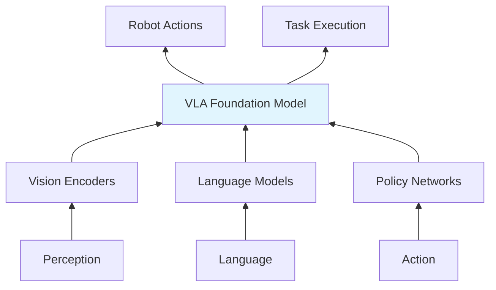

# Chapter 16 : Vision-Language-Action Models

## 16.1 Introduction to Embodied AI

The convergence of computer vision, natural language processing, and robotics has given rise to **Vision-Language-Action (VLA) models**—a new class of foundation models that can perceive visual scenes, understand language instructions, and generate appropriate actions in physical environments. These models represent a paradigm shift from traditional robotic control architectures toward more unified, end-to-end learnable systems.

### 16.1.1 The Emergence of VLA Models



**Historical Context:**
- **2018-2020**: Early attempts at multimodal learning (CLIP, ALIGN)
- **2021-2022**: First large-scale VLA models (PaLM-E, RT-1)
- **2023**: Scaling laws for robotics, embodied foundation models
- **2024-2025**: Real-world deployment and cognitive architectures

### 16.1.2 Key Advantages of VLA Models

**1. Unified Representation Learning**
- Single model learns joint representation of vision, language, and action
- Eliminates need for separate perception, planning, and control modules
- Enables zero-shot generalization to new tasks and environments

**2. Semantic Understanding**
- Natural language instruction following
- Grounded language understanding in physical contexts
- Commonsense reasoning about object affordances and interactions

**3. Sample Efficiency**
- Transfer learning from large-scale internet data
- Few-shot and zero-shot adaptation to new robots
- Improved generalization compared to task-specific models

### 16.1.3 Challenges in VLA Development

**Technical Challenges:**
- **Multimodal Fusion**: Effectively combining vision, language, and action modalities
- **Temporal Understanding**: Modeling sequential decision-making and long-term planning
- **Embodiment Gap**: Bridging simulation-to-reality and cross-robot transfer
- **Safety and Reliability**: Ensuring predictable behavior in complex environments

**Data Challenges:**
- **Scarcity**: Limited availability of large-scale robot demonstration datasets
- **Diversity**: Need for coverage across tasks, environments, and robot embodiments
- **Quality**: Ensuring data cleanliness and relevance for downstream tasks

## 16.2 Multimodal Foundation Models

### 16.2.1 Vision-Language Pretraining

Vision-language models serve as the perceptual foundation for VLA systems, providing rich understanding of visual scenes and semantic context.

**Key Architectures:**

```python
class VisionLanguageEncoder:
    def __init__(self, vision_model, language_model):
        self.vision_encoder = vision_model  # ViT, ConvNeXt, or CLIP-ViT
        self.language_encoder = language_model  # LLaMA, GPT, or T5
        self.projector = nn.Linear(vision_dim, text_dim)
        self.fusion_layer = CrossAttentionLayer()

    def forward(self, images, text):
        # Encode visual and textual inputs
        vision_features = self.vision_encoder(images)
        text_features = self.language_encoder(text)

        # Project to common embedding space
        vision_proj = self.projector(vision_features)

        # Cross-modal attention
        fused_features = self.fusion_layer(
            query=text_features,
            key=vision_proj,
            value=vision_proj
        )

        return fused_features
```

**Pretraining Objectives:**

1. **Image-Text Contrastive Learning**
   ```python
   def contrastive_loss(image_features, text_features, temperature=0.07):
       # Normalize embeddings
       image_features = F.normalize(image_features, dim=-1)
       text_features = F.normalize(text_features, dim=-1)

       # Compute similarity matrix
       logits = torch.matmul(image_features, text_features.T) / temperature

       # Symmetric loss
       labels = torch.arange(logits.shape[0])
       loss_i2t = F.cross_entropy(logits, labels)
       loss_t2i = F.cross_entropy(logits.T, labels)

       return (loss_i2t + loss_t2i) / 2
   ```

2. **Masked Language Modeling with Vision Grounding**
3. **Image-Text Matching**
4. **Visual Question Answering**

### 16.2.2 Action Conditioning and Control

VLA models extend vision-language understanding with action generation capabilities, creating end-to-end systems that can execute tasks based on visual observations and language instructions.

**Action Prediction Heads:**

```python
class VLAHead(nn.Module):
    def __init__(self, hidden_dim, action_dim):
        super().__init__()
        self.action_head = nn.Sequential(
            nn.Linear(hidden_dim, hidden_dim * 2),
            nn.ReLU(),
            nn.Dropout(0.1),
            nn.Linear(hidden_dim * 2, action_dim)
        )

        # Multi-head prediction for different time horizons
        self.short_term_head = nn.Linear(hidden_dim, action_dim)  # 1 step
        self.medium_term_head = nn.Linear(hidden_dim, action_dim)  # 10 steps
        self.long_term_head = nn.Linear(hidden_dim, action_dim)   # 100 steps

    def forward(self, features):
        return {
            'immediate': self.short_term_head(features),
            'near_future': self.medium_term_head(features),
            'long_term': self.long_term_head(features)
        }
```

**Action Space Representations:**

1. **End-Effector Poses**: 6D pose (position + orientation)
2. **Joint Angles**: Robot-specific joint configurations
3. **Velocity Commands**: Linear and angular velocities
4. **High-Level Primitives**: Grasp, place, push, etc.
5. **Language Actions**: Natural language action descriptions

### 16.2.3 Cross-Modal Attention Mechanisms

Cross-modal attention is the core mechanism enabling effective fusion of vision, language, and action information.

**Attention Patterns:**

```python
class CrossModalAttention(nn.Module):
    def __init__(self, d_model, n_heads):
        super().__init__()
        self.d_model = d_model
        self.n_heads = n_heads
        self.d_k = d_model // n_heads

        self.w_q = nn.Linear(d_model, d_model)
        self.w_k = nn.Linear(d_model, d_model)
        self.w_v = nn.Linear(d_model, d_model)
        self.w_o = nn.Linear(d_model, d_model)

    def forward(self, query, key, value, mask=None):
        batch_size = query.size(0)

        # Linear projections
        Q = self.w_q(query).view(batch_size, -1, self.n_heads, self.d_k).transpose(1, 2)
        K = self.w_k(key).view(batch_size, -1, self.n_heads, self.d_k).transpose(1, 2)
        V = self.w_v(value).view(batch_size, -1, self.n_heads, self.d_k).transpose(1, 2)

        # Scaled dot-product attention
        scores = torch.matmul(Q, K.transpose(-2, -1)) / math.sqrt(self.d_k)

        if mask is not None:
            scores = scores.masked_fill(mask == 0, -1e9)

        attention = F.softmax(scores, dim=-1)
        context = torch.matmul(attention, V)

        # Concatenate heads
        context = context.transpose(1, 2).contiguous().view(
            batch_size, -1, self.d_model
        )

        return self.w_o(context)
```

**Attention Patterns in VLA:**
- **Vision→Language**: Visual grounding of language concepts
- **Language→Vision**: Attention guided by linguistic cues
- **Action→Vision**: Attention to task-relevant visual features
- **Language→Action**: Action selection based on language instructions

## 16.3 Training Methodologies

### 16.3.1 Large-Scale Data Collection

Training VLA models requires diverse and large-scale datasets covering various robots, tasks, and environments.

**Data Sources:**

1. **Web-Scale Video Datasets**
   - Ego4D: First-person perspective videos
   - HowTo100M: Instructional videos with weak supervision
   - EPIC-KITCHENS: Daily activities in kitchen environments
   - VLOG: Vlogs with natural language narration

2. **Robot Demonstration Datasets**
   - RT-1 Dataset: 130k episodes across 700+ tasks
   - Bridge Data: Everyday household manipulation tasks
   - CALVIN: Language-conditioned manipulation
   - Fractal: Robot trajectories with language annotations

3. **Synthetic Data Generation**
   ```python
   class SyntheticDataGenerator:
       def __init__(self, simulator, task_templates):
           self.sim = simulator
           self.templates = task_template

       def generate_episode(self, task_spec):
           # Parse task specification
           actions = self.parse_task(task_spec)

           # Execute in simulation
           observations = []
           for action in actions:
               obs = self.sim.step(action)
               observations.append(obs)

           # Generate language description
           description = self.generate_description(task_spec, actions)

           return {
               'observations': observations,
               'actions': actions,
               'language': description,
               'task': task_spec
           }
   ```

**Data Augmentation Strategies:**
- **Geometric**: Random crops, rotations, flips
- **Photometric**: Color jitter, brightness, contrast changes
- **Temporal**: Speed variations, action smoothing
- **Domain Randomization**: Texture, lighting, physics parameters

### 16.3.2 Multi-Task Learning Objectives

VLA models are trained with a combination of objectives to develop comprehensive understanding and action capabilities.

**Primary Objectives:**

1. **Action Prediction Loss**
   ```python
   def action_prediction_loss(pred_actions, gt_actions, action_mask):
       # MSE for continuous actions
       mse_loss = F.mse_loss(pred_actions, gt_actions, reduction='none')

       # Apply mask for valid action timesteps
       masked_loss = mse_loss * action_mask.unsqueeze(-1)

       return masked_loss.sum() / action_mask.sum()
   ```

2. **Language Understanding Loss**
   ```python
   def language_understanding_loss(model, images, instructions, actions):
       # Predict actions from vision + language
       pred_actions = model(images, instructions)

       # Contrastive alignment
       vision_lang_emb = model.encode_vision_lang(images, instructions)
       action_emb = model.encode_actions(actions)

       contrastive_loss = InfoNCELoss(vision_lang_emb, action_emb)

       return action_prediction_loss(pred_actions, actions) + contrastive_loss
   ```

3. **Multimodal Contrastive Learning**
4. **Task Classification Loss**
5. **Success Prediction Loss**

**Curriculum Learning Strategy:**
```python
class CurriculumScheduler:
    def __init__(self, total_steps):
        self.total_steps = total_steps
        self.current_step = 0

    def get_task_weights(self, step):
        # Start with simple tasks, progress to complex ones
        progress = step / self.total_steps

        weights = {
            'reaching': max(0, 1 - progress),
            'grasping': min(1, progress * 2),
            'manipulation': max(0, (progress - 0.5) * 2),
            'tool_use': max(0, (progress - 0.7) * 3)
        }

        return weights
```

### 16.3.3 Fine-Tuning and Adaptation

Pretrained VLA models require careful adaptation for specific robots and tasks.

**Adapter Layers:**
```python
class RobotAdapter(nn.Module):
    def __init__(self, base_model, robot_specific_dim):
        super().__init__()
        self.base_model = base_model
        self.adapter = nn.Sequential(
            nn.Linear(base_model.hidden_dim, 64),
            nn.ReLU(),
            nn.Linear(64, robot_specific_dim)
        )

    def forward(self, x, robot_id):
        base_features = self.base_model(x)
        adapted_features = self.adapter(base_features)

        return adapted_features
```

**Few-Shot Adaptation:**
```python
def few_shot_adaptation(model, support_set, query_set, n_way, k_shot):
    # Meta-learning approach for rapid adaptation

    # Extract features from support set
    support_features = []
    support_labels = []

    for task, examples in support_set.items():
        for example in examples:
            feat = model.encode(example['image'], example['instruction'])
            support_features.append(feat)
            support_labels.append(task)

    # Build prototype vectors
    prototypes = {}
    for task in set(support_labels):
        task_feats = [f for f, l in zip(support_features, support_labels) if l == task]
        prototypes[task] = torch.stack(task_feats).mean(0)

    # Classify query examples
    predictions = []
    for example in query_set:
        feat = model.encode(example['image'], example['instruction'])

        # Compute distances to prototypes
        distances = {
            task: torch.dist(feat, proto)
            for task, proto in prototypes.items()
        }

        predicted_task = min(distances, key=distances.get)
        predictions.append(predicted_task)

    return predictions
```

## 16.4 Robot-Specific VLA Models

### 16.4.1 RT-Series: Google Robotics Transformer

The RT-series represents a landmark achievement in scaling VLA models for real-world robotics applications.

**RT-1 Architecture:**
```python
class RT1(nn.Module):
    def __init__(self, vit_config, transformer_config, action_dim):
        super().__init__()

        # Vision encoder (EfficientNet-B3)
        self.image_encoder = EfficientNet.from_name('efficientnet-b3')
        self.image_processor = ImageProcessor()

        # Tokenizer for instructions
        self.tokenizer = AutoTokenizer.from_pretrained('t5-small')
        self.text_encoder = T5EncoderModel.from_pretrained('t5-small')

        # Action tokenizer
        self.action_tokenizer = ActionTokenizer(action_dim)

        # Transformer decoder
        self.transformer = TransformerDecoder(
            d_model=512,
            nhead=8,
            num_layers=8,
            dim_feedforward=2048
        )

        # Output projection
        self.action_head = nn.Linear(512, action_tokenizer.vocab_size)

    def forward(self, image, instruction):
        # Process image
        image_features = self.image_processor(image)
        image_emb = self.image_encoder(image_features)

        # Process instruction
        text_inputs = self.tokenizer(
            instruction,
            return_tensors='pt',
            padding=True,
            truncation=True
        )
        text_emb = self.text_encoder(text_inputs.input_ids).last_hidden_state

        # Combine image and text embeddings
        combined_emb = torch.cat([image_emb, text_emb], dim=1)

        # Generate action tokens
        action_tokens = self.transformer(combined_emb)
        action_logits = self.action_head(action_tokens)

        return action_logits
```

**RT-1 Training Pipeline:**
```python
class RT1TrainingPipeline:
    def __init__(self, model, config):
        self.model = model
        self.config = config
        self.optimizer = torch.optim.AdamW(
            model.parameters(),
            lr=config.learning_rate,
            weight_decay=config.weight_decay
        )

    def train_step(self, batch):
        images = batch['images']
        instructions = batch['instructions']
        actions = batch['actions']

        # Forward pass
        action_logits = self.model(images, instructions)

        # Compute loss
        action_tokens = self.model.action_tokenizer(actions)
        loss = F.cross_entropy(
            action_logits.view(-1, action_logits.size(-1)),
            action_tokens.view(-1)
        )

        # Backward pass
        self.optimizer.zero_grad()
        loss.backward()
        self.optimizer.step()

        return loss.item()
```

### 16.4.2 PaLM-E: Embodied Language Model

PaLM-E extends large language models with embodied capabilities by incorporating continuous sensor observations directly into the language model.

**PaLM-E Architecture:**
```python
class PaLME(nn.Module):
    def __init__(self, llm_config, vision_encoder_config):
        super().__init__()

        # Large language model backbone (PaLM)
        self.llm = PaLMModel(**llm_config)

        # Vision encoder for encoding images/video
        self.vision_encoder = VisionTransformer(**vision_encoder_config)

        # Sensor encoders for proprioception
        self.joint_encoder = nn.Linear(num_joints, embed_dim)
        self.force_encoder = nn.Linear(num_force_sensors, embed_dim)

        # Projectors to align modalities with language embedding space
        self.vision_projector = nn.Linear(vision_dim, embed_dim)
        self.sensor_projector = nn.Linear(sensor_dim, embed_dim)

    def embed_multimodal_input(self, text, images, sensors):
        # Get text embeddings
        text_emb = self.llm.embed_text(text)

        # Process and project visual input
        if images is not None:
            vision_emb = self.vision_encoder(images)
            vision_proj = self.vision_projector(vision_emb)
            text_emb = torch.cat([text_emb, vision_proj], dim=1)

        # Process and project sensor data
        if sensors is not None:
            sensor_emb = torch.cat([
                self.joint_encoder(sensors['joint_positions']),
                self.force_encoder(sensors['force_torque'])
            ], dim=-1)
            sensor_proj = self.sensor_projector(sensor_emb)
            text_emb = torch.cat([text_emb, sensor_proj], dim=1)

        return text_emb

    def forward(self, text, images=None, sensors=None):
        # Embed multimodal input
        embeddings = self.embed_multimodal_input(text, images, sensors)

        # Pass through language model
        outputs = self.llm(inputs_embeds=embeddings)

        return outputs
```

### 16.4.3 Octo: Generalist Robot Policy

Octo represents a step toward truly generalist robot policies that can handle diverse robots and tasks through a unified model.

**Octo Architecture Features:**

1. **Transformer-based backbone with multi-modal fusion**
2. **Robot-agnostic action spaces**
3. **Task-conditioned policy generation**
4. **Multi-task training on 800+ datasets**

```python
class OctoModel(nn.Module):
    def __init__(self, config):
        super().__init__()

        # Multi-modal encoder
        self.vision_encoder = VisionTransformer(config.vision)
        self proprioception_encoder = MLP(config.proprioception)
        self.task_encoder = TransformerEncoder(config.task)

        # Fusion transformer
        self.fusion_transformer = TransformerDecoder(config.fusion)

        # Robot-specific action heads
        self.action_heads = nn.ModuleDict({
            'bimanual': BimanualActionHead(config.action_dim),
            'mobile_base': MobileBaseActionHead(config.action_dim),
            'arm_gripper': ArmGripperActionHead(config.action_dim)
        })

        # Robot embedding
        self.robot_embedding = nn.Embedding(num_robots, config.embed_dim)

    def forward(self, observations, task, robot_type):
        # Encode different observation modalities
        vision_features = self.vision_encoder(observations['images'])
        proprio_features = self.proprioception_encoder(observations['proprio'])
        task_features = self.task_encoder(task)

        # Add robot-specific embedding
        robot_emb = self.robot_embedding(robot_type)

        # Fuse all modalities
        fused_features = self.fusion_transformer(
            vision_features,
            proprio_features,
            task_features,
            robot_emb
        )

        # Generate robot-specific actions
        actions = self.action_heads[robot_type](fused_features)

        return actions
```

## 16.5 Real-World Applications

### 16.5.1 Household Assistance

VLA models enable robots to perform complex household tasks through natural language understanding and visual perception.

**Task Execution Pipeline:**
```python
class HouseholdAssistant:
    def __init__(self, vla_model, perception_system, manipulation_system):
        self.vla_model = vla_model
        self.perception = perception_system
        self.manipulation = manipulation_system

    def execute_task(self, instruction, environment):
        # Parse and understand the instruction
        task_understanding = self.vla_model.parse_instruction(instruction)

        # Observe the environment
        observation = self.perception.observe(environment)

        # Plan the task sequence
        task_plan = self.vla_model.plan_task(
            instruction,
            observation,
            task_understanding
        )

        # Execute the plan
        for subtask in task_plan.subtasks:
            # Generate actions for each subtask
            actions = self.vla_model.generate_actions(
                subtask,
                observation
            )

            # Execute actions
            for action in actions:
                self.manipulation.execute(action)

                # Update observation
                observation = self.perception.observe(environment)

                # Verify progress
                if self.verify_subtask_completion(subtask, observation):
                    break

        return True
```

**Common Household Tasks:**
- **Object Manipulation**: Pick, place, organize items
- **Kitchen Tasks**: Set table, prepare simple meals, clean up
- **Cleaning**: Vacuum, wipe surfaces, organize spaces
- **Laundry**: Sort, wash, fold clothes
- **Assistance**: Retrieve items, help with mobility

### 16.5.2 Industrial Automation

In industrial settings, VLA models enable flexible automation that can adapt to new tasks and products with minimal reprogramming.

**Assembly Line Application:**
```python
class IndustrialVLAController:
    def __init__(self, vla_model, safety_monitor):
        self.vla_model = vla_model
        self.safety = safety_monitor

    def handle_assembly_task(self, task_description, workspace_state):
        # Safety check before execution
        if not self.safety.check_workspace(workspace_state):
            raise SafetyException("Workspace not safe for operation")

        # Generate assembly plan
        assembly_plan = self.vla_model.generate_assembly_plan(
            task_description,
            workspace_state
        )

        # Execute assembly with monitoring
        for step in assembly_plan.steps:
            # Generate actions
            actions = self.vla_model.generate_step_actions(step)

            # Execute with safety monitoring
            for action in actions:
                if self.safety.is_action_safe(action, workspace_state):
                    self.robot.execute(action)
                    workspace_state = self.perception.update_state()
                else:
                    self.handle_safety_violation(action, workspace_state)

        return True
```

### 16.5.3 Healthcare and Assistance

VLA models in healthcare must handle additional constraints including safety, privacy, and patient comfort.

**Healthcare Assistance System:**
```python
class HealthcareAssistant:
    def __init__(self, vla_model, patient_monitor):
        self.vla_model = vla_model
        self.monitor = patient_monitor

    def assist_patient(self, request, patient_state):
        # Check patient condition
        vital_signs = self.monitor.get_vital_signs()

        # Modify actions based on patient state
        if vital_signs['stress_level'] > threshold:
            # Gentle, slower movements
            action_modifier = 'gentle'
        else:
            action_modifier = 'normal'

        # Generate assistance actions
        actions = self.vla_model.generate_assistance_actions(
            request,
            patient_state,
            action_modifier
        )

        # Execute with continuous monitoring
        for action in actions:
            self.monitor.check_patient_comfort()

            if self.monitor.is_safe_to_proceed():
                self.execute_action(action)
            else:
                self.stop_and_assess()

        return True
```

## 16.6 Evaluation and Benchmarks

### 16.6.1 Standardized Evaluation Protocols

**Calvin Benchmark:**
```python
class CalvinEvaluator:
    def __init__(self, environment, tasks):
        self.env = environment
        self.tasks = tasks

    def evaluate_agent(self, agent, num_episodes=100):
        results = {}

        for task_name, task_spec in self.tasks.items():
            task_success = []
            task_efficiency = []

            for episode in range(num_episodes):
                # Reset environment
                obs = self.env.reset(task=task_spec)

                # Track episode metrics
                steps = 0
                max_steps = 500
                success = False

                while steps < max_steps:
                    # Agent action
                    action = agent.act(obs, task_spec.instruction)

                    # Environment step
                    obs, reward, done, info = self.env.step(action)
                    steps += 1

                    if done:
                        success = info['success']
                        break

                task_success.append(success)
                task_efficiency.append(steps / max_steps)

            results[task_name] = {
                'success_rate': np.mean(task_success),
                'efficiency': 1 - np.mean(task_efficiency)
            }

        return results
```

**Metrics for VLA Evaluation:**

1. **Task Success Rate**: Percentage of successfully completed tasks
2. **Sample Efficiency**: Number of demonstrations needed for good performance
3. **Generalization**: Performance on unseen tasks/environments
4. **Robustness**: Performance under perturbations and noise
5. **Safety**: Frequency of unsafe actions or collisions
6. **Language Understanding**: Correct interpretation of instructions

### 16.6.2 Real-World Evaluation Challenges

**Simulation-to-Reality Gap:**
```python
class Sim2RealEvaluator:
    def __init__(self, sim_env, real_env):
        self.sim_env = sim_env
        self.real_env = real_env

    def evaluate_domain_gap(self, agent, tasks):
        sim_results = {}
        real_results = {}

        for task in tasks:
            # Evaluate in simulation
            sim_perf = self.evaluate_in_environment(agent, task, self.sim_env)
            sim_results[task] = sim_perf

            # Evaluate on real robot
            real_perf = self.evaluate_in_environment(agent, task, self.real_env)
            real_results[task] = real_perf

        # Compute domain gap
        domain_gap = {}
        for task in tasks:
            gap = abs(sim_results[task] - real_results[task])
            domain_gap[task] = gap

        return {
            'simulation': sim_results,
            'real': real_results,
            'gap': domain_gap,
            'average_gap': np.mean(list(domain_gap.values()))
        }
```

### 16.6.3 Human Evaluation

**Human Preference Scoring:**
```python
class HumanPreferenceEvaluator:
    def __init__(self, evaluation_criteria):
        self.criteria = evaluation_criteria

    def collect_preferences(self, demonstrations, human_evaluators):
        preferences = []

        for evaluator in human_evaluators:
            for demo_pair in demonstrations:
                # Present two demonstrations to evaluator
                demo1, demo2 = demo_pair

                # Collect preference
                preference = evaluator.compare_demonstrations(demo1, demo2)

                preferences.append({
                    'evaluator': evaluator.id,
                    'demo1_id': demo1.id,
                    'demo2_id': demo2.id,
                    'preference': preference,  # 1, 2, or tie
                    'reasoning': evaluator.get_reasoning()
                })

        return self.compute_elo_ratings(preferences)
```

## 16.7 Challenges and Limitations

### 16.7.1 Technical Challenges

**1. Scalability vs. Specialization Trade-off**
- Large models generalize well but may be suboptimal for specific tasks
- Task-specific fine-tuning can reduce generalization capabilities
- Computational requirements for inference on edge devices

**2. Long-Horizon Planning**
- Difficulty maintaining coherent behavior over extended sequences
- Accumulation of errors in long action sequences
- Memory limitations for complex multi-step tasks

**3. Real-Time Constraints**
- Latency requirements for interactive tasks
- Trade-offs between model size and inference speed
- Hardware limitations on robotic platforms

### 16.7.2 Safety and Reliability

**Safety Monitoring Framework:**
```python
class VLASafetyMonitor:
    def __init__(self, safety_constraints):
        self.constraints = safety_constraints
        self.risk_assessor = RiskAssessor()

    def monitor_action(self, action, state, context):
        # Check immediate safety
        if self.violates_constraints(action, state):
            return SafetyStatus.UNSAFE, "Constraint violation"

        # Assess risk level
        risk_score = self.risk_assessor.assess_risk(action, state, context)

        if risk_score > self.thresholds.high:
            return SafetyStatus.HIGH_RISK, f"Risk score: {risk_score}"
        elif risk_score > self.thresholds.medium:
            return SafetyStatus.MEDIUM_RISK, f"Risk score: {risk_score}"
        else:
            return SafetyStatus.SAFE, f"Risk score: {risk_score}"

    def suggest_modification(self, action, state):
        # Suggest safer alternative
        alternative = self.generate_safe_alternative(action, state)
        return alternative
```

### 16.7.3 Data and Distribution Shift

**Domain Adaptation Strategies:**
```python
class DomainAdaptationModule:
    def __init__(self, source_model, adaptation_method):
        self.model = source_model
        self.method = adaptation_method

    def adapt_to_domain(self, target_data):
        if self.method == 'fine_tuning':
            return self.fine_tune(target_data)
        elif self.method == 'few_shot':
            return self.few_shot_adaptation(target_data)
        elif self.method == 'domain_adversarial':
            return self.domain_adversarial_training(target_data)

    def detect_domain_shift(self, new_data):
        # Statistical tests for distribution shift
        source_features = self.model.encode(self.source_data)
        target_features = self.model.encode(new_data)

        # Compute KL divergence
        shift_score = self.compute_kl_divergence(
            source_features, target_features
        )

        return shift_score > self.shift_threshold
```

## 16.8 Future Directions

### 16.8.1 Cognitive Architectures

**Hierarchical VLA Systems:**
```python
class CognitiveVLA:
    def __init__(self):
        # Low-level reactive controller
        self.reactive_controller = VLAReactiveController()

        # Mid-level deliberative planner
        self.deliberative_planner = VLADeliberativePlanner()

        # High-level reasoning system
        self.reasoning_system = VLAReasoningSystem()

        # Memory system
        self.episodic_memory = EpisodicMemory()
        self.semantic_memory = SemanticMemory()

    def process_instruction(self, instruction, context):
        # High-level understanding
        task_representation = self.reasoning_system.parse_and_plan(
            instruction, context, self.semantic_memory
        )

        # Retrieve relevant experiences
        relevant_episodes = self.episodic_memory.retrieve(task_representation)

        # Generate detailed plan
        detailed_plan = self.deliberative_planner.plan(
            task_representation,
            relevant_episodes
        )

        # Execute with reactive control
        for subtask in detailed_plan.subtasks:
            self.execute_subtask(subtask)

            # Store experience
            self.episodic_memory.store(subtask, context, outcome)
```

### 16.8.2 Multimodal Foundation Models

**3D Vision and Action Integration:**
```python
class MultimodalFoundationModel:
    def __init__(self):
        # 2D vision encoder
        self.vision_2d = VisionTransformer2D()

        # 3D vision encoder
        self.vision_3d = VisionTransformer3D()

        # Audio encoder for ambient sounds
        self.audio_encoder = AudioTransformer()

        # Tactile encoder for touch sensing
        self.tactile_encoder = TactileTransformer()

        # Unified multimodal transformer
        self.unified_transformer = UnifiedMultimodalTransformer()

    def forward(self, observations):
        # Encode all modalities
        features_2d = self.vision_2d(observations['rgb'])
        features_3d = self.vision_3d(observations['point_cloud'])
        features_audio = self.audio_encoder(observations['audio'])
        features_tactile = self.tactile_encoder(observations['tactile'])

        # Fuse modalities
        unified_features = self.unified_transformer(
            vision_2d=features_2d,
            vision_3d=features_3d,
            audio=features_audio,
            tactile=features_tactile
        )

        # Generate actions
        actions = self.action_head(unified_features)

        return actions
```

### 16.8.3 Embodied Simulation Training

**Large-Scale Simulation Training:**
```python
class EmbodiedSimulationTrainer:
    def __init__(self, simulation_framework):
        self.sim_framework = simulation_framework
        self.curriculum = EmbodiedCurriculum()

    def train_vla_model(self, model, config):
        for stage in self.curriculum.stages:
            # Create simulation environments
            environments = self.sim_framework.create_environments(
                stage.config
            )

            # Train on diverse tasks
            for epoch in range(stage.epochs):
                for env in environments:
                    # Sample task
                    task = self.curriculum.sample_task(stage, env)

                    # Execute and collect data
                    trajectory = self.execute_task(model, env, task)

                    # Update model
                    loss = self.update_model(model, trajectory)

                    # Evaluate progress
                    if epoch % config.eval_interval == 0:
                        self.evaluate_model(model, stage.test_tasks)

        return model
```

### 16.8.4 Human-Robot Collaboration

**Collaborative VLA Systems:**
```python
class CollaborativeVLA:
    def __init__(self, vla_model, human_interface):
        self.vla = vla_model
        self.human_interface = human_interface
        self.collaboration_memory = CollaborationMemory()

    def collaborative_task_execution(self, task_description, human_partner):
        # Establish shared understanding
        shared_plan = self.establish_shared_plan(
            task_description, human_partner
        )

        # Execute with human in the loop
        while not shared_plan.completed():
            # Robot proposes action
            robot_action = self.vla.propose_action(
                current_state, shared_plan
            )

            # Human review and feedback
            human_feedback = self.human_interface.get_feedback(
                robot_action, human_partner
            )

            if human_feedback.approved:
                # Execute action
                self.execute_action(robot_action)
            else:
                # Incorporate human correction
                self.incorporate_feedback(human_feedback)

            # Update shared understanding
            shared_plan.update_progress()

        return True
```

## 16.9 Conclusion

Vision-Language-Action models represent a fundamental shift in how we approach robotic intelligence, unifying perception, understanding, and action in a single learned system. As these models continue to scale and improve, they promise to unlock new capabilities in household assistance, industrial automation, healthcare, and beyond.

The journey toward truly embodied AI is still in its early stages, but the rapid progress in VLA models suggests a future where robots can understand natural language instructions, perceive their environments richly, and execute complex tasks with the flexibility and adaptability that humans naturally possess.

### Key Takeaways:

1. **VLA models unify vision, language, and action** in end-to-end learnable systems
2. **Large-scale pretraining** on diverse datasets enables generalization to new tasks
3. **Robot-specific adaptations** are necessary for real-world deployment
4. **Safety and reliability** remain critical challenges for practical applications
5. **Cognitive architectures** promise to address long-horizon planning and reasoning
6. **Human-robot collaboration** will be essential for widespread adoption

The next decade will likely see VLA models becoming increasingly sophisticated, moving from single-task systems to truly generalist robots that can learn and adapt throughout their operational lifetimes.

## Further Reading

- "RT-1: Robotics Transformer for Real-World Control" (Brohan et al., 2022)
- "PaLM-E: An Embodied Multimodal Language Model" (Driess et al., 2023)
- "Octo: A Generalist Robot Policy" (Team et al., 2023)
- "Foundation Models for Embodied AI" (Achiam et al., 2023)
- "Scaling Laws for Robotics" (Baker et al., 2022)
