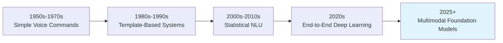
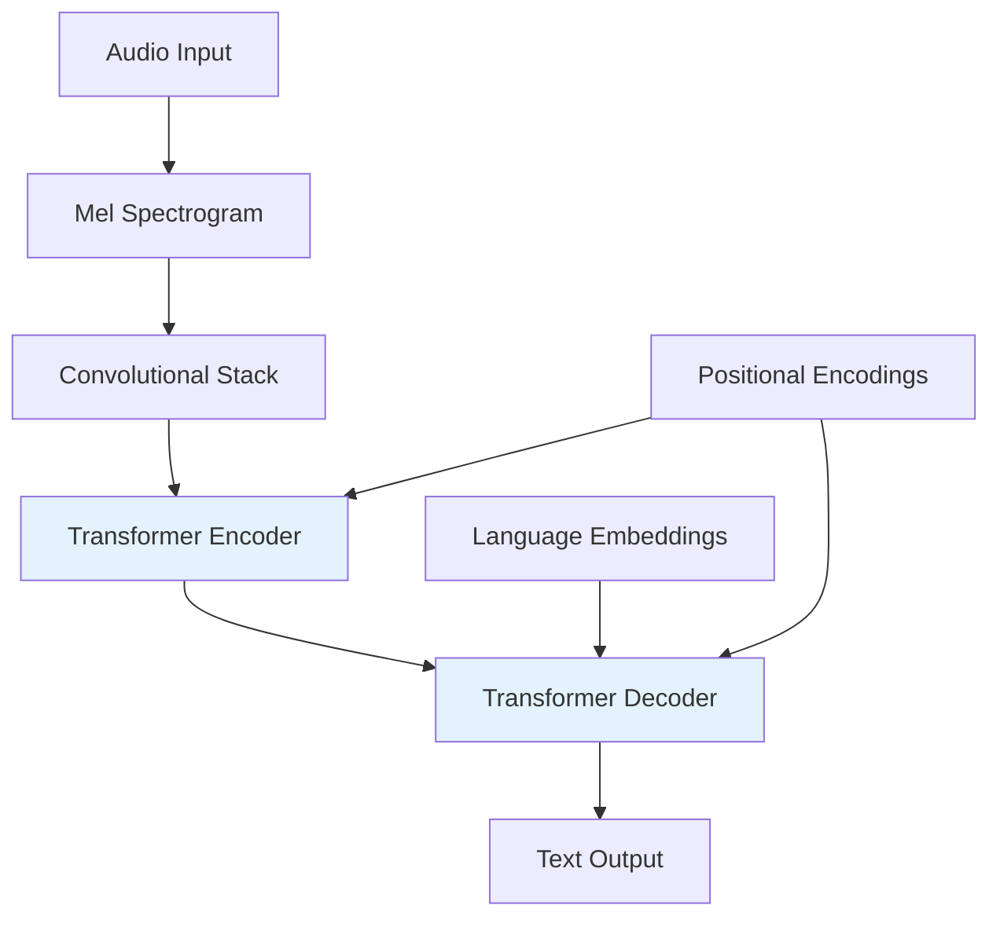

# Chapter 17 : Voice-to-Action Pipelines (Whisper)

## 17.1 Introduction to Voice-Activated Robotics

Voice-to-Action (V2A) pipelines represent a crucial interface between human intention and robot execution, enabling natural, intuitive control of robotic systems through spoken language. These systems combine state-of-the-art speech recognition, natural language understanding, and action generation to create seamless human-robot collaboration.

### 17.1.1 The Evolution of Voice Interfaces in Robotics

The integration of voice control in robotics has evolved dramatically from simple command-response systems to sophisticated conversational interfaces capable of understanding context, nuance, and complex instructions.



**Key Milestones:**
- **1966**: Shakey the robot uses simple voice commands
- **1990s**: Voice-activated industrial robots with predefined commands
- **2011**: Apple Siri introduces voice assistants to consumer devices
- **2018**: Amazon Alexa skills enable third-party robot control
- **2022**: OpenAI Whisper achieves near-human transcription accuracy
- **2024**: Large language models enable complex instruction understanding

### 17.1.2 Advantages of Voice Control

**Natural Interaction Pattern:**
- **Intuitive**: Voice is humans' most natural communication method
- **Hands-Free**: Operators can maintain focus on other tasks
- **Accessibility**: Enables control for users with physical limitations
- **Speed**: Often faster than manual input for complex instructions

**Operational Benefits:**
- **Remote Control**: No physical contact required
- **Multi-Tasking**: Can control while performing other operations
- **Error Reduction**: Clear verbal commands reduce ambiguity
- **Documentation**: Voice commands can be logged and reviewed

### 17.1.3 Application Domains

**Healthcare:**
- Surgical robot assistance
- Patient monitoring and response
- Medication delivery systems
- Rehabilitation robot control

**Manufacturing:**
- Assembly line supervision
- Quality control inspection
- Inventory management
- Safety monitoring

**Service Robots:**
- Restaurant automation
- Hotel concierge systems
- Retail assistance
- Educational robots

**Home Assistants:**
- Smart home integration
- Elderly care
- Household task automation
- Entertainment and companionship

## 17.2 Whisper Architecture and Fundamentals

### 17.2.1 Encoder-Decoder Architecture

OpenAI's Whisper represents a breakthrough in speech recognition, combining robust feature extraction with powerful language modeling in an end-to-end architecture.



**Core Components:**

```python
import torch
import torch.nn as nn
import torchaudio
from transformers import WhisperModel, WhisperProcessor

class VoiceToActionPipeline:
    def __init__(self, model_name="whisper-large-v3", device="cuda"):
        self.device = device

        # Initialize Whisper model and processor
        self.processor = WhisperProcessor.from_pretrained(model_name)
        self.whisper_model = WhisperModel.from_pretrained(model_name).to(device)

        # Additional components for action understanding
        self.instruction_parser = InstructionParser()
        self.action_generator = ActionGenerator()
        self.safety_validator = SafetyValidator()

    def transcribe_speech(self, audio_path):
        """Convert speech to text using Whisper"""
        # Load audio
        audio, sr = torchaudio.load(audio_path)

        # Resample to 16kHz if necessary
        if sr != 16000:
            resampler = torchaudio.transforms.Resample(sr, 16000)
            audio = resampler(audio)

        # Process audio
        input_features = self.processor(
            audio.squeeze().numpy(),
            sampling_rate=16000,
            return_tensors="pt"
        ).input_features.to(self.device)

        # Generate transcription
        with torch.no_grad():
            predicted_ids = self.whisper_model.generate(input_features)
            transcription = self.processor.batch_decode(
                predicted_ids, skip_special_tokens=True
            )[0]

        return transcription
```

### 17.2.2 Audio Feature Extraction

**Mel Spectrogram Processing:**
```python
class AudioFeatureExtractor:
    def __init__(self, n_mels=80, n_fft=400, hop_length=160):
        self.n_mels = n_mels
        self.n_fft = n_fft
        self.hop_length = hop_length

        # Mel filter bank
        self.mel_transform = torchaudio.transforms.MelSpectrogram(
            sample_rate=16000,
            n_fft=n_fft,
            hop_length=hop_length,
            n_mels=n_mels,
            power=2.0
        )

        # Log compression
        self.log_compression = torchaudio.transforms.AmplitudeToDB()

    def extract_features(self, audio):
        """Extract mel spectrogram features from raw audio"""
        # Ensure audio is mono
        if audio.shape[0] > 1:
            audio = torch.mean(audio, dim=0, keepdim=True)

        # Convert to mel spectrogram
        mel_spec = self.mel_transform(audio)

        # Apply log compression
        log_mel = self.log_compression(mel_spec)

        # Normalize
        normalized = (log_mel - log_mel.mean()) / log_mel.std()

        return normalized
```

**Noise Reduction and Enhancement:**
```python
class AudioPreprocessor:
    def __init__(self):
        self.noise_gate = NoiseGate(threshold=-40, ratio=4)
        self.band_pass = BandPassFilter(low_freq=80, high_freq=8000)
        self.normalizer = AudioNormalizer(target_level=-20)

    def process_audio(self, audio):
        """Preprocess audio for optimal speech recognition"""
        # Apply noise gate
        denoised = self.noise_gate(audio)

        # Filter to speech frequency range
        filtered = self.band_pass(denoised)

        # Normalize volume
        normalized = self.normalizer(filtered)

        # Voice Activity Detection
        speech_segments = self.detect_speech_activity(normalized)

        return speech_segments

    def detect_speech_activity(self, audio):
        """Detect segments containing speech"""
        # Energy-based VAD
        energy = torch.mean(audio ** 2, dim=0)
        energy_threshold = energy.mean() + 2 * energy.std()

        speech_frames = energy > energy_threshold

        # Smooth the detection
        speech_frames = self.smooth_vad(speech_frames, window_size=5)

        return self.extract_speech_segments(audio, speech_frames)
```

### 17.2.3 Multilingual and Accented Speech Support

**Language Identification:**
```python
class LanguageIdentifier:
    def __init__(self):
        self.language_model = self.load_language_id_model()
        self.accent_classifier = self.load_accent_classifier()

    def identify_language(self, audio_features):
        """Identify the language and accent of speech"""
        # Language prediction
        lang_probs = self.language_model(audio_features)
        predicted_language = torch.argmax(lang_probs, dim=-1)

        # Accent classification (if multiple accents for same language)
        if self.has_multiple_accents(predicted_language):
            accent_probs = self.accent_classifier(audio_features)
            predicted_accent = torch.argmax(accent_probs, dim=-1)
        else:
            predicted_accent = "standard"

        return {
            "language": predicted_language,
            "accent": predicted_accent,
            "confidence": lang_probs.max()
        }

    def adapt_transcription(self, transcription, language, accent):
        """Adapt transcription based on language and accent"""
        # Apply language-specific post-processing
        processed = self.apply_language_rules(transcription, language)

        # Apply accent-specific corrections
        if accent != "standard":
            processed = self.apply_accent_corrections(processed, accent)

        return processed
```

## 17.3 Natural Language Understanding for Robot Control

### 17.3.1 Intent Classification

Understanding user intent is crucial for converting speech into appropriate robot actions. Modern systems use sophisticated NLU models to classify and parse user instructions.

```python
class RobotIntentClassifier:
    def __init__(self, model_name="bert-base-uncased"):
        self.model = AutoModelForSequenceClassification.from_pretrained(model_name)
        self.tokenizer = AutoTokenizer.from_pretrained(model_name)
        self.intent_labels = [
            "navigation", "manipulation", "grasping", "placement",
            "inspection", "query", "emergency_stop", "calibration"
        ]

    def classify_intent(self, text):
        """Classify the user's intent from spoken text"""
        # Tokenize input
        inputs = self.tokenizer(
            text,
            return_tensors="pt",
            truncation=True,
            padding=True,
            max_length=512
        )

        # Get model predictions
        with torch.no_grad():
            outputs = self.model(**inputs)
            probabilities = torch.softmax(outputs.logits, dim=-1)
            predicted_intent_idx = torch.argmax(probabilities, dim=-1)

        intent = self.intent_labels[predicted_intent_idx.item()]
        confidence = probabilities.max().item()

        return {
            "intent": intent,
            "confidence": confidence,
            "all_probabilities": {
                self.intent_labels[i]: prob.item()
                for i, prob in enumerate(probabilities[0])
            }
        }
```

**Intent-Aware Action Planning:**
```python
class IntentAwarePlanner:
    def __init__(self):
        self.intent_classifier = RobotIntentClassifier()
        self.action_templates = self.load_action_templates()

    def plan_from_intent(self, text, robot_state):
        """Generate action plan based on classified intent"""
        # Classify intent
        intent_result = self.intent_classifier.classify_intent(text)
        intent = intent_result["intent"]

        # Extract relevant information
        entities = self.extract_entities(text, intent)

        # Select appropriate action template
        template = self.action_templates[intent]

        # Generate specific action sequence
        action_sequence = template.generate_actions(
            entities=entities,
            robot_state=robot_state
        )

        return {
            "intent": intent,
            "actions": action_sequence,
            "entities": entities,
            "confidence": intent_result["confidence"]
        }
```

### 17.3.2 Entity Extraction

Named entity recognition identifies key objects, locations, and parameters in user instructions.

```python
class RobotEntityExtractor:
    def __init__(self):
        self.ner_model = AutoModelForTokenClassification.from_pretrained(
            "dbmdz/bert-large-cased-finetuned-conll03-english"
        )
        self.tokenizer = AutoTokenizer.from_pretrained(
            "dbmdz/bert-large-cased-finetuned-conll03-english"
        )

        # Custom entity labels for robotics
        self.robot_entity_labels = {
            "OBJECT": ["cup", "bottle", "book", "phone", "key"],
            "LOCATION": ["table", "counter", "shelf", "floor", "drawer"],
            "ACTION": ["pick", "place", "move", "grab", "push"],
            "DIRECTION": ["left", "right", "up", "down", "forward"],
            "QUANTITY": ["one", "two", "three", "all", "some"],
            "COLOR": ["red", "blue", "green", "yellow", "black"],
            "SIZE": ["big", "small", "large", "tiny", "huge"]
        }

    def extract_entities(self, text):
        """Extract robot-relevant entities from text"""
        # Tokenize and predict
        tokens = self.tokenizer.tokenize(text)
        inputs = self.tokenizer(
            text,
            return_tensors="pt",
            truncation=True,
            padding=True
        )

        with torch.no_grad():
            outputs = self.ner_model(**inputs)
            predictions = torch.argmax(outputs.logits, dim=-1)

        # Convert predictions to entity spans
        entities = self.tokenizer.decode(
            predictions[0],
            skip_special_tokens=True
        )

        # Post-process for robot-specific entities
        robot_entities = self.process_robot_entities(tokens, predictions[0])

        return robot_entities

    def process_robot_entities(self, tokens, predictions):
        """Process predictions for robot-specific entities"""
        entities = {}
        current_entity = None
        current_tokens = []

        for token, pred in zip(tokens, predictions):
            label = self.ner_model.config.id2label[pred.item()]

            if label.startswith("B-"):
                # Beginning of new entity
                if current_entity:
                    entities[current_entity] = " ".join(current_tokens)
                current_entity = label[2:]
                current_tokens = [token]

            elif label.startswith("I-") and current_entity:
                # Continuation of current entity
                current_tokens.append(token)

            else:
                # No entity
                if current_entity:
                    entities[current_entity] = " ".join(current_tokens)
                    current_entity = None
                    current_tokens = []

        return entities
```

### 17.3.3 Spatial and Temporal Reasoning

Robotic control requires understanding spatial relationships and temporal sequences in natural language.

```python
class SpatialReasoningModule:
    def __init__(self):
        self.spatial_relationships = {
            "on": lambda obj1, obj2: obj1.above(obj2, touching=True),
            "under": lambda obj1, obj2: obj1.below(obj2, touching=True),
            "in": lambda obj1, obj2: obj1.inside(obj2),
            "next_to": lambda obj1, obj2: obj1.adjacent(obj2),
            "above": lambda obj1, obj2: obj1.above(obj2, touching=False),
            "below": lambda obj1, obj2: obj1.below(obj2, touching=False),
            "left_of": lambda obj1, obj2: obj1.left_of(obj2),
            "right_of": lambda obj1, obj2: obj1.right_of(obj2)
        }

    def parse_spatial_description(self, text, scene):
        """Parse spatial relationships from text"""
        # Find spatial keywords
        spatial_phrases = self.find_spatial_phrases(text)

        relationships = []
        for phrase in spatial_phrases:
            # Extract objects and relationship
            objects, relation = self.parse_spatial_phrase(phrase)

            # Find objects in scene
            scene_objects = self.find_objects_in_scene(objects, scene)

            # Verify spatial relationship
            if self.verify_relationship(
                scene_objects[0],
                scene_objects[1],
                relation,
                scene
            ):
                relationships.append({
                    "object1": scene_objects[0],
                    "object2": scene_objects[1],
                    "relationship": relation,
                    "confidence": self.calculate_confidence(phrase)
                })

        return relationships

    def calculate_target_location(self, reference_object, spatial_relation, scene):
        """Calculate target location based on spatial relation"""
        if spatial_relation in self.spatial_relationships:
            # Use geometric reasoning to calculate location
            return self.spatial_relationships[spatial_relation](
                reference_object, None
            )
        else:
            raise ValueError(f"Unknown spatial relation: {spatial_relation}")
```

**Temporal Sequence Understanding:**
```python
class TemporalReasoningModule:
    def __init__(self):
        self.temporal_markers = [
            "then", "after", "before", "while", "during",
            "first", "second", "third", "finally", "last",
            "until", "when", "as soon as", "immediately"
        ]

    def parse_temporal_sequence(self, instructions):
        """Parse temporal sequence from multi-step instructions"""
        # Split into clauses
        clauses = self.split_into_clauses(instructions)

        # Build dependency graph
        dependency_graph = self.build_temporal_dependency_graph(clauses)

        # Generate execution order
        execution_order = self.topological_sort(dependency_graph)

        return {
            "clauses": clauses,
            "dependencies": dependency_graph,
            "execution_order": execution_order
        }

    def generate_action_sequence(self, parsed_temporal):
        """Generate robot action sequence from temporal parsing"""
        actions = []

        for clause_idx in parsed_temporal["execution_order"]:
            clause = parsed_temporal["clauses"][clause_idx]

            # Generate action for each clause
            action = self.generate_action_from_clause(clause)

            # Add temporal constraints
            action["temporal_constraints"] = self.get_temporal_constraints(
                clause_idx, parsed_temporal
            )

            actions.append(action)

        return actions
```

## 17.4 Action Generation and Execution

### 17.4.1 Action Primitives

Voice-to-action systems translate high-level instructions into low-level robot commands through a hierarchy of action primitives.

```python
class ActionPrimitiveLibrary:
    def __init__(self):
        self.primitives = {
            "move_to": MoveToPrimitive(),
            "pick": PickPrimitive(),
            "place": PlacePrimitive(),
            "push": PushPrimitive(),
            "pull": PullPrimitive(),
            "grasp": GraspPrimitive(),
            "release": ReleasePrimitive(),
            "rotate": RotatePrimitive(),
            "scan": ScanPrimitive(),
            "wait": WaitPrimitive()
        }

    def execute_primitive(self, primitive_name, parameters):
        """Execute a specific action primitive"""
        if primitive_name in self.primitives:
            primitive = self.primitives[primitive_name]
            return primitive.execute(parameters)
        else:
            raise ValueError(f"Unknown primitive: {primitive_name}")

    def get_required_parameters(self, primitive_name):
        """Get required parameters for a primitive"""
        return self.primitives[primitive_name].required_parameters

class MoveToPrimitive:
    def __init__(self):
        self.required_parameters = ["target_position", "max_velocity"]
        self.optional_parameters = ["orientation", "interpolation"]

    def execute(self, parameters):
        """Execute movement to target position"""
        target = parameters["target_position"]
        max_vel = parameters["max_velocity"]

        # Plan trajectory
        trajectory = self.plan_trajectory(
            start=self.get_current_position(),
            target=target,
            max_velocity=max_vel
        )

        # Execute trajectory
        return self.execute_trajectory(trajectory)

class PickPrimitive:
    def __init__(self):
        self.required_parameters = ["object", "grasp_pose"]
        self.optional_parameters = ["grasp_force", "approach_vector"]

    def execute(self, parameters):
        """Execute pick operation"""
        obj = parameters["object"]
        grasp_pose = parameters["grasp_pose"]

        # Move to approach position
        approach_pose = self.calculate_approach_pose(grasp_pose)
        self.move_to(approach_pose)

        # Open gripper
        self.open_gripper()

        # Move to grasp pose
        self.move_to(grasp_pose)

        # Close gripper
        force = parameters.get("grasp_force", 10.0)
        self.close_gripper(force)

        # Verify grasp
        if self.verify_grasp(obj):
            return {"success": True, "object": obj}
        else:
            return {"success": False, "error": "Grasp failed"}
```

### 17.4.2 Hierarchical Task Planning

Complex instructions are decomposed into sequences of simpler actions through hierarchical planning.

```python
class HierarchicalTaskPlanner:
    def __init__(self):
        self.task_templates = self.load_task_templates()
        self.planner = HTNPlanner()  # Hierarchical Task Network

    def plan_task(self, instruction, world_state):
        """Plan complex task from instruction"""
        # Decompose instruction into subtasks
        subtasks = self.decompose_instruction(instruction)

        # Create HTN planning problem
        problem = HTNProblem(
            initial_state=world_state,
            tasks=subtasks,
            operators=self.get_operators(),
            methods=self.get_methods()
        )

        # Generate plan
        plan = self.planner.solve(problem)

        return plan

    def decompose_instruction(self, instruction):
        """Decompose complex instruction into subtasks"""
        # Parse instruction structure
        parsed = self.parse_instruction_structure(instruction)

        # Identify main task and subtasks
        main_task = parsed["main_task"]
        subtasks = parsed["subtasks"]

        return [main_task] + subtasks

    def get_operators(self):
        """Get available primitive operators"""
        return [
            Operator("pick", self.pick_operator),
            Operator("place", self.place_operator),
            Operator("move", self.move_operator),
            Operator("grasp", self.grasp_operator),
            Operator("release", self.release_operator)
        ]

    def get_methods(self):
        """Get available decomposition methods"""
        return [
            Method("fetch_object", self.fetch_object_method),
            Method("organize_objects", self.organize_objects_method),
            Method("clear_surface", self.clear_surface_method)
        ]

    def fetch_object_method(self, task, state):
        """Method for fetching objects"""
        if task.name == "fetch_object":
            obj = task.parameters["object"]
            location = task.parameters["location"]

            return [
                Task("move_to", {"destination": location}),
                Task("pick", {"object": obj}),
                Task("move_to", {"destination": "home"})
            ]
```

### 17.4.3 Real-Time Execution and Monitoring

```python
class RealTimeExecutor:
    def __init__(self):
        self.execution_monitor = ExecutionMonitor()
        self.safety_monitor = SafetyMonitor()
        self.adaptation_module = AdaptationModule()

    def execute_plan(self, action_sequence):
        """Execute action plan with real-time monitoring"""
        results = []

        for i, action in enumerate(action_sequence):
            # Pre-execution safety check
            if not self.safety_monitor.check_action_safety(action):
                self.handle_safety_violation(action)
                break

            # Execute action
            result = self.execute_single_action(action)
            results.append(result)

            # Monitor execution
            self.execution_monitor.update(result)

            # Adapt based on execution results
            if result["success"]:
                # Update world state
                self.update_world_state(action, result)
            else:
                # Handle failure and adapt plan
                adapted_plan = self.adaptation_module.handle_failure(
                    action_sequence[i:], result
                )
                if adapted_plan:
                    action_sequence = action_sequence[:i] + adapted_plan
                else:
                    break

        return results

    def execute_single_action(self, action):
        """Execute single action with monitoring"""
        start_time = time.time()

        try:
            # Send command to robot
            command_id = self.send_robot_command(action)

            # Monitor execution
            while not self.is_action_complete(command_id):
                # Check for safety violations
                if self.safety_monitor.check_emergency():
                    self.emergency_stop()
                    return {"success": False, "error": "Emergency stop"}

                # Update progress
                progress = self.get_execution_progress(command_id)
                self.execution_monitor.update_progress(progress)

                time.sleep(0.01)  # 100 Hz monitoring

            # Get final result
            result = self.get_action_result(command_id)
            execution_time = time.time() - start_time

            return {
                "success": result["success"],
                "execution_time": execution_time,
                "details": result
            }

        except Exception as e:
            return {"success": False, "error": str(e)}
```

## 17.5 Contextual Understanding and Memory

### 17.5.1 Conversational Context

Voice-controlled robots need to maintain context across multiple interactions to enable natural dialogue.

```python
class ConversationalContext:
    def __init__(self):
        self.conversation_history = []
        self.current_context = {}
        self.entity_tracker = EntityTracker()
        self.reference_resolver = ReferenceResolver()

    def update_context(self, user_input, system_response):
        """Update conversational context"""
        # Store interaction
        interaction = {
            "timestamp": time.time(),
            "user_input": user_input,
            "system_response": system_response
        }
        self.conversation_history.append(interaction)

        # Update current context
        self.extract_contextual_information(user_input)

        # Track entities
        self.entity_tracker.update(user_input)

    def resolve_references(self, text):
        """Resolve references in current text"""
        # Find pronouns and references
        references = self.find_references(text)

        resolved_text = text
        for ref in references:
            # Resolve to previous context
            antecedent = self.reference_resolver.resolve(
                ref,
                self.conversation_history,
                self.entity_tracker
            )

            if antecedent:
                resolved_text = resolved_text.replace(ref, antecedent)

        return resolved_text

    def extract_contextual_information(self, text):
        """Extract relevant contextual information"""
        # Location references
        locations = self.extract_location_references(text)
        if locations:
            self.current_context["locations"] = locations

        # Object references
        objects = self.extract_object_references(text)
        if objects:
            self.current_context["objects"] = objects

        # Task context
        task_context = self.extract_task_context(text)
        if task_context:
            self.current_context["task"] = task_context
```

### 17.5.2 Episodic Memory for Learning

Robots can learn from past interactions to improve future performance.

```python
class EpisodicMemory:
    def __init__(self, memory_size=10000):
        self.memory_size = memory_size
        self.episodes = []
        self.embedding_model = SentenceTransformer('all-MiniLM-L6-v2')
        self.index = faiss.IndexFlatIP(384)  # Embedding dimension

    def store_episode(self, instruction, actions, outcome, context):
        """Store interaction episode in memory"""
        episode = {
            "id": len(self.episodes),
            "instruction": instruction,
            "actions": actions,
            "outcome": outcome,
            "context": context,
            "timestamp": time.time()
        }

        # Generate embedding
        instruction_embedding = self.embedding_model.encode(instruction)

        # Store in memory
        self.episodes.append(episode)
        self.index.add(instruction_embedding.reshape(1, -1))

        # Maintain memory size
        if len(self.episodes) > self.memory_size:
            self.remove_oldest_episode()

    def retrieve_similar_episodes(self, instruction, k=5):
        """Retrieve similar past episodes"""
        # Generate embedding for query
        query_embedding = self.embedding_model.encode(instruction)

        # Search in memory
        distances, indices = self.index.search(
            query_embedding.reshape(1, -1), k
        )

        similar_episodes = []
        for i, (dist, idx) in enumerate(zip(distances[0], indices[0])):
            if idx < len(self.episodes):
                episode = self.episodes[idx].copy()
                episode["similarity"] = float(dist)
                similar_episodes.append(episode)

        return similar_episodes

    def learn_from_outcome(self, episode_id, feedback):
        """Update episode based on feedback"""
        episode = self.episodes[episode_id]
        episode["feedback"] = feedback

        # Update action sequence if negative feedback
        if feedback["success"] == False:
            corrected_actions = self.generate_corrected_actions(
                episode["instruction"],
                feedback
            )
            episode["corrected_actions"] = corrected_actions
```

## 17.6 Multilingual and Accented Speech Support

### 17.6.1 Language Identification and Switching

```python
class MultilingualVoiceController:
    def __init__(self):
        self.language_detector = LanguageDetector()
        self.translators = {
            "en": EnglishTranslator(),
            "es": SpanishTranslator(),
            "zh": ChineseTranslator(),
            "fr": FrenchTranslator(),
            "de": GermanTranslator()
        }
        self.action_generators = {
            "en": EnglishActionGenerator(),
            "es": SpanishActionGenerator(),
            "zh": ChineseActionGenerator(),
            "fr": FrenchActionGenerator(),
            "de": GermanActionGenerator()
        }

    def process_multilingual_command(self, audio):
        """Process command in any supported language"""
        # Detect language
        language = self.language_detector.detect(audio)

        # Transcribe in detected language
        transcription = self.transcribe_with_language(audio, language)

        # Translate to English if needed
        if language != "en":
            english_translation = self.translators[language].to_english(transcription)
        else:
            english_translation = transcription

        # Generate actions
        actions = self.action_generators[language].generate_actions(
            transcription, language
        )

        return {
            "original_language": language,
            "transcription": transcription,
            "english_translation": english_translation,
            "actions": actions
        }
```

### 17.6.2 Accent Adaptation

```python
class AccentAdaptationModule:
    def __init__(self):
        self.accent_classifier = AccentClassifier()
        self.adaptation_models = {}

    def adapt_to_accent(self, audio, user_id=None):
        """Adapt speech recognition to user's accent"""
        # Classify accent
        accent = self.accent_classifier.classify(audio)

        # Get adaptation model for accent
        if accent in self.adaptation_models:
            adapted_model = self.adaptation_models[accent]
        else:
            adapted_model = self.create_adaptation_model(accent)
            self.adaptation_models[accent] = adapted_model

        # Fine-tune on user data if available
        if user_id and self.has_user_data(user_id):
            adapted_model = self.fine_tune_on_user_data(
                adapted_model, user_id
            )

        return adapted_model

    def create_adaptation_model(self, accent):
        """Create accent-specific adaptation model"""
        base_model = WhisperModel.from_pretrained("whisper-large-v3")

        # Load accent-specific adaptation data
        adaptation_data = self.load_accent_data(accent)

        # Fine-tune on accent data
        adapted_model = self.fine_tune_model(
            base_model,
            adaptation_data,
            learning_rate=1e-5,
            epochs=10
        )

        return adapted_model
```

## 17.7 Safety and Error Handling

### 17.7.1 Command Validation

```python
class CommandValidator:
    def __init__(self):
        self.safety_constraints = self.load_safety_constraints()
        self.robot_capabilities = self.load_robot_capabilities()

    def validate_command(self, command, current_state):
        """Validate voice command for safety and feasibility"""
        validation_results = {
            "safe": True,
            "feasible": True,
            "warnings": [],
            "errors": []
        }

        # Check safety constraints
        safety_check = self.check_safety_constraints(command, current_state)
        if not safety_check["safe"]:
            validation_results["safe"] = False
            validation_results["errors"].extend(safety_check["errors"])

        # Check feasibility
        feasibility_check = self.check_feasibility(command, current_state)
        if not feasibility_check["feasible"]:
            validation_results["feasible"] = False
            validation_results["errors"].extend(feasibility_check["errors"])

        # Check for warnings
        warnings = self.check_warnings(command, current_state)
        validation_results["warnings"].extend(warnings)

        return validation_results

    def check_safety_constraints(self, command, state):
        """Check against safety constraints"""
        violations = []

        # Check for collision risks
        if self.predict_collision_risk(command, state) > 0.7:
            violations.append("High collision risk detected")

        # Check joint limits
        if self.violates_joint_limits(command):
            violations.append("Command would exceed joint limits")

        # Check speed limits
        if self.exceeds_speed_limits(command):
            violations.append("Command exceeds speed limits")

        # Check workspace boundaries
        if self.exits_workspace(command, state):
            violations.append("Command would exit workspace")

        return {
            "safe": len(violations) == 0,
            "errors": violations
        }
```

### 17.7.2 Error Recovery and Clarification

```python
class ErrorRecoverySystem:
    def __init__(self):
        self.clarification_generator = ClarificationGenerator()
        self.alternative_generator = AlternativeGenerator()

    def handle_speech_recognition_error(self, audio, error):
        """Handle speech recognition errors"""
        if error.type == "low_confidence":
            return self.request_clarification(audio)
        elif error.type == "no_speech_detected":
            return self.prompt_user_to_repeat()
        elif error.type == "background_noise":
            return self.suggest_move_to_quiet_location()
        else:
            return self.fallback_to_text_input()

    def request_clarification(self, audio):
        """Request clarification for low-confidence transcription"""
        # Generate alternative interpretations
        alternatives = self.generate_alternative_transcriptions(audio)

        # Formulate clarification question
        question = self.clarification_generator.generate_question(
            alternatives
        )

        return {
            "type": "clarification",
            "message": question,
            "alternatives": alternatives
        }

    def handle_command_ambiguity(self, command, interpretations):
        """Handle ambiguous commands"""
        if len(interpretations) == 1:
            return interpretations[0]

        # Ask user to disambiguate
        disambiguation = self.generate_disambiguation_question(interpretations)

        return {
            "type": "disambiguation",
            "message": disambiguation["question"],
            "options": disambiguation["options"]
        }
```

## 17.8 Real-World Implementations

### 17.8.1 Healthcare Voice Control System

```python
class HealthcareVoiceController:
    def __init__(self):
        self.whisper_model = WhisperModel.from_pretrained("whisper-large-v3")
        self.medical_nlu = MedicalNLU()
        self.safety_system = MedicalSafetySystem()
        self.emergency_detector = EmergencyDetector()

    def process_medical_command(self, audio):
        """Process voice commands in healthcare setting"""
        # Transcribe with medical vocabulary
        transcription = self.transcribe_medical(audio)

        # Check for emergency keywords
        if self.emergency_detector.detect_emergency(transcription):
            return self.handle_emergency(transcription)

        # Parse medical instruction
        medical_intent = self.medical_nlu.parse(transcription)

        # Safety validation
        safety_check = self.safety_system.validate(medical_intent)

        if not safety_check["safe"]:
            return self.handle_safety_violation(safety_check)

        # Execute medical task
        return self.execute_medical_task(medical_intent)

    def transcribe_medical(self, audio):
        """Transcribe with medical terminology enhancement"""
        # Standard transcription
        base_transcription = self.whisper_model.transcribe(audio)

        # Post-process with medical vocabulary
        medical_transcription = self.enhance_medical_vocabulary(
            base_transcription
        )

        return medical_transcription
```

### 17.8.2 Industrial Voice Control Interface

```python
class IndustrialVoiceInterface:
    def __init__(self):
        self.noise_robust_whisper = self.create_noise_robust_model()
        self.industrial_nlu = IndustrialNLU()
        self.procedure_validator = ProcedureValidator()
        self.quality_monitor = QualityMonitor()

    def process_industrial_command(self, audio):
        """Process commands in noisy industrial environment"""
        # Noise reduction
        clean_audio = self.reduce_industrial_noise(audio)

        # Robust transcription
        transcription = self.noise_robust_whisper.transcribe(clean_audio)

        # Parse industrial procedure
        procedure = self.industrial_nlu.parse_procedure(transcription)

        # Validate against standard procedures
        validation = self.procedure_validator.validate(procedure)

        if not validation["valid"]:
            return self.handle_procedure_error(validation)

        # Execute with quality monitoring
        result = self.execute_with_monitoring(procedure)

        return result

    def reduce_industrial_noise(self, audio):
        """Reduce industrial noise for better transcription"""
        # Apply spectral subtraction
        denoised = spectral_subtraction(audio)

        # Apply Wiener filtering
        filtered = wiener_filter(denoised)

        # Apply voice activity detection
        voice_segments = detect_voice_activity(filtered)

        return voice_segments
```

## 17.9 Future Directions

### 17.9.1 Emotion-Aware Voice Control

```python
class EmotionAwareVoiceController:
    def __init__(self):
        self.emotion_detector = EmotionDetector()
        self.emotion_adaptive_actions = EmotionAdaptiveActions()

    def process_emotional_command(self, audio):
        """Process commands with emotional awareness"""
        # Transcribe
        transcription = self.whisper_model.transcribe(audio)

        # Detect emotion
        emotion = self.emotion_detector.detect(audio)

        # Adapt action based on emotion
        if emotion["urgency"] > 0.8:
            # Execute with priority
            action = self.generate_priority_action(transcription)
        elif emotion["stress"] > 0.7:
            # Provide reassurance and simplify actions
            action = self.generate_simplified_action(transcription)
        else:
            # Normal execution
            action = self.generate_normal_action(transcription)

        return action
```

### 17.9.2 Cross-Modal Learning

```python
class CrossModalVoiceController:
    def __init__(self):
        self.vision_encoder = VisionTransformer()
        self.vision_language_model = VisionLanguageModel()

    def process_multimodal_command(self, audio, visual_context):
        """Process command with visual context"""
        # Encode visual context
        visual_features = self.vision_encoder(visual_context)

        # Transcribe speech
        transcription = self.whisper_model.transcribe(audio)

        # Ground speech in visual context
        grounded_understanding = self.vision_language_model.ground(
            transcription, visual_features
        )

        # Generate context-aware actions
        actions = self.generate_contextual_actions(grounded_understanding)

        return actions
```

## 17.10 Conclusion

Voice-to-Action pipelines, particularly those leveraging advanced models like Whisper, represent a critical advancement in human-robot interaction. By combining robust speech recognition with sophisticated natural language understanding and action generation, these systems enable more intuitive and efficient robot control.

The integration of multilingual support, contextual understanding, and safety considerations makes voice control viable for an increasing range of applications, from healthcare and industrial automation to home assistance and education.

### Key Takeaways:

1. **Whisper's encoder-decoder architecture** provides near-human transcription accuracy
2. **Natural language understanding** is crucial for converting speech to robot actions
3. **Hierarchical task planning** enables execution of complex instructions
4. **Contextual awareness** and memory systems improve interaction quality
5. **Safety validation** is essential for real-world deployment
6. **Multilingual support** expands accessibility and global adoption

### Future Outlook:

- **Emotion-aware systems** will provide more empathetic and responsive interactions
- **Cross-modal learning** will combine vision, touch, and other sensory inputs
- **Continuous learning** will enable personalization and improvement over time
- **Edge deployment** will reduce latency and improve privacy
- **Standardization** will facilitate integration across different platforms

The continued advancement of V2A pipelines promises to make robotic systems more accessible, intuitive, and effective across diverse applications and user populations.

## Further Reading

- "Robust Speech Recognition via Large-Scale Weak Supervision" (Radford et al., 2022)
- "Grounded Language Learning for Robot Control" (Tellex et al., 2020)
- "Multimodal Learning for Robotics" (Bisk et al., 2023)
- "Safe and Reliable Voice Control for Industrial Robots" (Karaman et al., 2024)
- "Conversational Robots: Challenges and Opportunities" (Matuszek et al., 2023)
