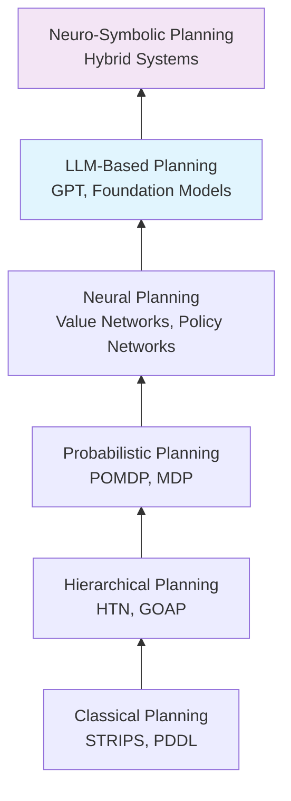

# Chapter 18 : Cognitive Planning with GPT

## 18.1 Introduction to Cognitive Planning

Cognitive planning represents the highest level of robotic intelligence, encompassing abstract reasoning, goal-directed behavior, and the ability to understand and execute complex, multi-step tasks. Large Language Models (LLMs) like GPT have emerged as powerful tools for enabling robots to perform human-like planning and decision-making.

### 18.1.1 The Evolution of Robotic Planning



The integration of GPT models into robotic planning systems represents a paradigm shift from traditional algorithmic approaches to more human-like, language-grounded reasoning capabilities.

### 18.1.2 Why GPT for Planning?

**Natural Language Understanding:**
- Direct interpretation of human instructions in natural language
- Ability to understand implicit goals and constraints
- Handling of ambiguity and clarification requests

**World Knowledge Integration:**
- Access to vast amounts of commonsense knowledge
- Understanding of physical laws and social conventions
- Knowledge about object properties, affordances, and relationships

**Generalization and Adaptation:**
- Zero-shot adaptation to novel tasks and environments
- Transfer learning from similar tasks
- Creative problem-solving beyond pre-programmed behaviors

### 18.1.3 Levels of Cognitive Planning

**1. Reactive Level:**
- Immediate response to sensory input
- Reflexive behaviors and stimulus-response patterns
- No deliberation or future planning

**2. Deliberative Level:**
- Short-term planning and goal sequencing
- Task decomposition into subgoals
- Consideration of immediate consequences

**3. Cognitive Level (GPT-based):**
- Long-term strategic planning
- Abstract reasoning and inference
- Understanding of user intentions and context
- Learning from experience and adaptation

## 18.2 GPT Architecture for Planning

### 18.2.1 Transformer-Based Reasoning

The transformer architecture that powers GPT models is particularly well-suited for planning tasks due to its ability to model long-range dependencies and maintain coherent representations across extended sequences.

```python
import torch
import torch.nn as nn
from transformers import GPT2LMHeadModel, GPT2Tokenizer

class CognitivePlanningGPT:
    def __init__(self, model_name="gpt-4", device="cuda"):
        self.device = device
        self.tokenizer = GPT2Tokenizer.from_pretrained(model_name)
        self.model = GPT2LMHeadModel.from_pretrained(model_name).to(device)

        # Special tokens for planning
        self.task_token = "<TASK>"
        self.goal_token = "<GOAL>"
        self.state_token = "<STATE>"
        self.plan_token = "<PLAN>"
        self.action_token = "<ACTION>"

        # Add special tokens
        self.tokenizer.add_special_tokens({
            'additional_special_tokens': [
                self.task_token, self.goal_token,
                self.state_token, self.plan_token, self.action_token
            ]
        })
        self.model.resize_token_embeddings(len(self.tokenizer))

    def generate_plan(self, task_description, current_state, goals):
        """Generate cognitive plan using GPT"""
        # Create planning prompt
        prompt = self.create_planning_prompt(
            task_description, current_state, goals
        )

        # Tokenize input
        inputs = self.tokenizer(
            prompt,
            return_tensors="pt",
            padding=True,
            truncation=True,
            max_length=2048
        ).to(self.device)

        # Generate plan
        with torch.no_grad():
            outputs = self.model.generate(
                inputs.input_ids,
                max_length=inputs.input_ids.shape[1] + 512,
                num_return_sequences=3,  # Generate multiple options
                temperature=0.7,
                top_p=0.9,
                do_sample=True,
                pad_token_id=self.tokenizer.eos_token_id
            )

        # Decode and parse plans
        plans = []
        for output in outputs:
            plan_text = self.tokenizer.decode(
                output[inputs.input_ids.shape[1]:],
                skip_special_tokens=True
            )
            parsed_plan = self.parse_plan(plan_text)
            plans.append(parsed_plan)

        return self.select_best_plan(plans, task_description, current_state)
```

### 18.2.2 Structured Planning Prompts

Effective GPT-based planning requires carefully engineered prompts that structure the reasoning process and guide the model toward coherent, actionable plans.

```python
class PlanningPromptEngineer:
    def __init__(self):
        self.planning_templates = self.load_planning_templates()
        self.example_plans = self.load_example_plans()

    def create_planning_prompt(self, task, state, goals):
        """Create structured prompt for planning task"""
        prompt = f"""{self.task_token} {task}

{self.state_token} Current state: {self.format_state(state)}

{self.goal_token} Goals: {self.format_goals(goals)}

{self.plan_token} Please generate a detailed plan to accomplish the task.

Consider:
1. What are the necessary subgoals?
2. What actions are needed for each subgoal?
3. What are the potential obstacles and how to overcome them?
4. What is the optimal sequence of actions?
5. What are the safety considerations?

Format your response as:
SUBGOAL 1: [description]
- ACTION 1.1: [action description]
- ACTION 1.2: [action description]

SUBGOAL 2: [description]
- ACTION 2.1: [action description]
...

Here are examples of good plans:
{self.format_examples()}

Now generate a plan for the current task:"""

        return prompt

    def format_state(self, state):
        """Format current state for prompt"""
        formatted = []
        for key, value in state.items():
            if isinstance(value, dict):
                formatted.append(f"{key}: {self.format_state(value)}")
            elif isinstance(value, list):
                formatted.append(f"{key}: {', '.join(value)}")
            else:
                formatted.append(f"{key}: {value}")
        return "\n  ".join(formatted)

    def create_refinement_prompt(self, initial_plan, feedback):
        """Create prompt for plan refinement"""
        return f"""{self.plan_token} Initial plan:
{initial_plan}

{self.feedback_token} Feedback:
{feedback}

{self.plan_token} Please refine the plan to address the feedback.
Maintain the same format but improve the specific areas mentioned in the feedback."""
```

### 18.2.3 Chain-of-Thought Planning

Chain-of-thought prompting encourages the model to show its reasoning process, leading to more robust and explainable plans.

```python
class ChainOfThoughtPlanner:
    def __init__(self, gpt_model):
        self.gpt_model = gpt_model

    def plan_with_reasoning(self, task, context):
        """Generate plan with explicit reasoning steps"""
        reasoning_prompt = f"""Task: {task}

Context: {context}

Let's think step by step to create a good plan:

Step 1: Understand the goal
- What is the main objective?
- What are the constraints?
- What resources are available?

Step 2: Break down into subgoals
- What are the logical phases of this task?
- Which subgoals depend on others?
- What are the prerequisites?

Step 3: Plan actions for each subgoal
- What specific actions are needed?
- In what order should they be executed?
- What could go wrong and how to prepare?

Step 4: Optimize and validate
- Can any actions be combined?
- Are there redundant steps?
- Is the plan safe and efficient?

Now, based on this reasoning, here is the final plan:"""

        return self.gpt_model.generate_plan(reasoning_prompt)
```

## 18.3 Task Decomposition and Goal Hierarchies

### 18.3.1 Hierarchical Task Networks

GPT can be used to automatically discover and create hierarchical task networks from high-level goals.

```python
class HTNGenerator:
    def __init__(self, gpt_model):
        self.gpt_model = gpt_model
        self.task_library = TaskLibrary()

    def generate_htn(self, high_level_task):
        """Generate hierarchical task network from high-level task"""
        # Step 1: Identify main subtasks
        subtask_prompt = f"""Break down the task "{high_level_task}" into main subtasks.
List them in logical order of execution."""

        subtasks = self.gpt_model.query(subtask_prompt)

        # Step 2: For each subtask, generate decomposition
        htn = {
            "root": high_level_task,
            "subtasks": []
        }

        for subtask in subtasks:
            decomposition = self.decompose_subtask(subtask)
            htn["subtasks"].append({
                "name": subtask,
                "decomposition": decomposition,
                "prerequisites": self.identify_prerequisites(subtask),
                "successors": self.identify_successors(subtask)
            })

        return htn

    def decompose_subtask(self, subtask):
        """Decompose subtask into primitive actions"""
        decomposition_prompt = f"""For the subtask "{subtask}":
1. What primitive actions are needed?
2. In what order should they be executed?
3. What are the parameters for each action?

Format as:
ACTION: [action_name]
PARAMETERS: [param1=value1, param2=value2]

Action sequence:"""

        return self.gpt_model.query(decomposition_prompt)

    def identify_prerequisites(self, subtask):
        """Identify prerequisites for subtask"""
        prereq_prompt = f"""What conditions must be satisfied before executing "{subtask}"?
Consider:
- Required objects or tools
- Preconditions on the environment
- Previous tasks that must be completed

List prerequisites:"""

        return self.gpt_model.query(prereq_prompt)
```

### 18.3.2 Goal-Oriented Planning

GPT can understand and reason about abstract goals, converting them into concrete action sequences.

```python
class GoalOrientedPlanner:
    def __init__(self, gpt_model):
        self.gpt_model = gpt_model
        self.goal_patterns = self.load_goal_patterns()

    def plan_from_goal(self, goal_specification, world_state):
        """Plan actions to achieve specified goals"""
        # Parse goal specification
        parsed_goals = self.parse_goals(goal_specification)

        # Generate initial plan
        initial_plan = self.generate_initial_plan(parsed_goals, world_state)

        # Validate against goals
        validation = self.validate_plan(initial_plan, parsed_goals, world_state)

        # Refine if necessary
        if not validation["valid"]:
            refined_plan = self.refine_plan(initial_plan, validation["issues"])
        else:
            refined_plan = initial_plan

        return refined_plan

    def parse_goals(self, goal_specification):
        """Parse natural language goal specification"""
        parse_prompt = f"""Extract goals from this specification: "{goal_specification}"

For each goal, identify:
1. The desired end state
2. Success criteria
3. Constraints
4. Priorities

Format as:
GOAL [N]: [description]
SUCCESS: [criteria]
CONSTRAINTS: [constraints]
PRIORITY: [high/medium/low]"""

        return self.gpt_model.query(parse_prompt)

    def generate_initial_plan(self, goals, state):
        """Generate initial plan to achieve goals"""
        planning_prompt = f"""Current state: {state}

Goals to achieve:
{self.format_goals(goals)}

Generate a plan that achieves all goals efficiently.
Consider dependencies between goals and potential conflicts.

Plan:"""

        return self.gpt_model.query(planning_prompt)
```

## 18.4 World Modeling and Simulation

### 18.4.1 Mental Simulation

GPT can perform mental simulation by reasoning about the consequences of actions without actual execution.

```python
class MentalSimulator:
    def __init__(self, gpt_model):
        self.gpt_model = gpt_model
        self.physics_knowledge = self.load_physics_knowledge()
        self.object_knowledge = self.load_object_knowledge()

    def simulate_action(self, action, initial_state):
        """Simulate the outcome of an action"""
        simulation_prompt = f"""Initial state: {self.format_state(initial_state)}

Action to simulate: {self.format_action(action)}

Using knowledge about physics and object properties, predict:
1. Immediate effects of the action
2. Changes to the environment
3. New state after action execution
4. Potential side effects or risks

Simulated outcome:"""

        outcome = self.gpt_model.query(simulation_prompt)
        return self.parse_simulated_outcome(outcome)

    def simulate_plan(self, plan, initial_state):
        """Simulate execution of entire plan"""
        current_state = initial_state
        simulation_log = []

        for action in plan["actions"]:
            # Simulate single action
            action_result = self.simulate_action(action, current_state)

            # Update state
            current_state = self.update_state(current_state, action_result)

            # Log simulation
            simulation_log.append({
                "action": action,
                "pre_state": current_state,
                "predicted_result": action_result,
                "post_state": current_state
            })

        return {
            "final_state": current_state,
            "simulation_log": simulation_log,
            "success": self.check_plan_success(plan["goals"], current_state)
        }
```

### 18.4.2 Commonsense Reasoning

Integrating commonsense knowledge enables more robust planning in everyday situations.

```python
class CommonsensePlanner:
    def __init__(self, gpt_model):
        self.gpt_model = gpt_model
        self.commonsense_db = self.load_commonsense_knowledge()

    def enhance_plan_with_commonsense(self, initial_plan, context):
        """Enhance plan with commonsense reasoning"""
        enhanced_plan = initial_plan.copy()

        # Check for commonsense violations
        violations = self.check_commonsense_violations(enhanced_plan, context)

        # Fix violations
        for violation in violations:
            fix = self.generate_fix(violation)
            enhanced_plan = self.apply_fix(enhanced_plan, fix)

        # Add commonsense optimizations
        optimizations = self.suggest_commonsense_optimizations(enhanced_plan, context)
        enhanced_plan = self.apply_optimizations(enhanced_plan, optimizations)

        return enhanced_plan

    def check_commonsense_violations(self, plan, context):
        """Check plan for commonsense violations"""
        violation_prompt = f"""Review this plan for commonsense issues:

Plan: {self.format_plan(plan)}
Context: {context}

Check for:
- Actions that violate physical laws
- Socially inappropriate behaviors
- Unsafe or dangerous actions
- Inefficient or impractical steps

List any violations found:"""

        return self.gpt_model.query(violation_prompt)
```

## 18.5 Adaptive Planning and Learning

### 18.5.1 Plan Adaptation Based on Feedback

GPT can adapt plans based on execution feedback and changing conditions.

```python
class AdaptivePlanner:
    def __init__(self, gpt_model):
        self.gpt_model = gpt_model
        self.execution_history = ExecutionHistory()

    def adapt_plan(self, current_plan, execution_feedback):
        """Adapt plan based on execution feedback"""
        # Analyze feedback
        analysis = self.analyze_feedback(execution_feedback)

        # Determine adaptation strategy
        if analysis["success_rate"] < 0.5:
            strategy = "replan"
        elif analysis["frequent_failures"]:
            strategy = "modify_failing_steps"
        elif analysis["inefficient"]:
            strategy = "optimize"
        else:
            strategy = "minor_adjustments"

        # Adapt plan
        if strategy == "replan":
            return self.generate_new_plan(
                current_plan["goal"],
                execution_feedback["current_state"]
            )
        else:
            return self.modify_plan(current_plan, analysis, strategy)

    def analyze_feedback(self, feedback):
        """Analyze execution feedback"""
        analysis_prompt = f"""Analyze this execution feedback:

Feedback: {feedback}

Determine:
1. Overall success rate
2. Most common failure points
3. Efficiency assessment
4. Patterns in failures
5. Recommendations for improvement

Analysis:"""

        return self.gpt_model.query(analysis_prompt)

    def learn_from_execution(self, plan, execution_log):
        """Learn from plan execution"""
        learning_prompt = f"""Review this plan execution:

Original plan: {self.format_plan(plan)}
Execution log: {execution_log}

Identify:
1. What worked well
2. What failed and why
3. Better approaches for similar future tasks
4. Generalizable lessons

Learning insights:"""

        insights = self.gpt_model.query(learning_prompt)
        self.update_knowledge_base(insights)
```

### 18.5.2 Continuous Learning

GPT-based planners can continuously improve through experience.

```python
class ContinuousLearningPlanner:
    def __init__(self, gpt_model):
        self.gpt_model = gpt_model
        self.experience_buffer = []
        self.success_patterns = []
        self.failure_patterns = []

    def update_from_experience(self, task, plan, execution_result):
        """Update planner based on new experience"""
        experience = {
            "task": task,
            "plan": plan,
            "result": execution_result,
            "timestamp": time.time()
        }

        self.experience_buffer.append(experience)

        # Extract patterns
        if execution_result["success"]:
            self.extract_success_pattern(experience)
        else:
            self.extract_failure_pattern(experience)

        # Retrain or fine-tune periodically
        if len(self.experience_buffer) % 100 == 0:
            self.update_model()

    def extract_success_pattern(self, experience):
        """Extract patterns from successful executions"""
        pattern_prompt = f"""Analyze this successful planning experience:

Task: {experience['task']}
Plan: {self.format_plan(experience['plan'])}
Result: {experience['result']}

Identify:
1. Key planning decisions that led to success
2. Generalizable strategies
3. Situations where this approach would work
4. Pattern that can be applied to similar tasks

Success pattern:"""

        pattern = self.gpt_model.query(pattern_prompt)
        self.success_patterns.append(pattern)

    def adapt_to_new_domain(self, domain_examples):
        """Adapt planner to new domain using examples"""
        domain_prompt = f"""Learn planning patterns for this domain from examples:

Domain examples: {domain_examples}

Extract:
1. Domain-specific constraints
2. Common task patterns
3. Specialized strategies
4. Domain knowledge to incorporate

Domain adaptation guidelines:"""

        guidelines = self.gpt_model.query(domain_prompt)
        self.apply_domain_adaptation(guidelines)
```

## 18.6 Multi-Agent Planning

### 18.6.1 Coordination and Communication

GPT can facilitate planning for multiple robots working together.

```python
class MultiAgentPlanner:
    def __init__(self, gpt_model):
        self.gpt_model = gpt_model
        self.agent_capabilities = AgentCapabilities()

    def coordinate_multi_agent_plan(self, task, agents):
        """Coordinate plan across multiple agents"""
        # Analyze task for parallelization opportunities
        parallelizable = self.analyze_parallelization(task, agents)

        # Assign responsibilities
        assignments = self.assign_tasks(parallelizable, agents)

        # Generate individual plans
        individual_plans = {}
        for agent_id, assigned_tasks in assignments.items():
            individual_plans[agent_id] = self.generate_individual_plan(
                assigned_tasks, agents[agent_id]
            )

        # Generate coordination protocol
        coordination = self.generate_coordination_protocol(
            individual_plans, task
        )

        return {
            "individual_plans": individual_plans,
            "coordination_protocol": coordination,
            "dependencies": self.identify_dependencies(individual_plans)
        }

    def generate_coordination_protocol(self, plans, task):
        """Generate communication protocol for coordination"""
        protocol_prompt = f"""Generate a coordination protocol for these agents executing this task:

Task: {task}
Agent plans: {self.format_plans(plans)}

Specify:
1. Communication events and messages
2. Synchronization points
3. Conflict resolution strategies
4. Exception handling procedures
5. Progress sharing mechanism

Coordination protocol:"""

        return self.gpt_model.query(protocol_prompt)
```

### 18.6.2 Negotiation and Conflict Resolution

```python
class NegotiationPlanner:
    def __init__(self, gpt_model):
        self.gpt_model = gpt_model

    def negotiate_plan_conflicts(self, agent_plans, constraints):
        """Negotiate and resolve conflicts in multi-agent plans"""
        # Identify conflicts
        conflicts = self.identify_conflicts(agent_plans)

        # Generate negotiation strategies
        negotiation_prompt = f"""Agents have conflicting plans:

Conflicts: {self.format_conflicts(conflicts)}
Constraints: {constraints}
Agent preferences: {self.get_agent_preferences()}

Generate a negotiation strategy that:
1. Identifies compromise solutions
2. Prioritizes based on task criticality
3. Ensures all agents can contribute
4. Maintains overall system efficiency

Negotiation approach:"""

        negotiation_strategy = self.gpt_model.query(negotiation_prompt)

        # Apply strategy to resolve conflicts
        resolved_plans = self.apply_negotiation_strategy(
            agent_plans, negotiation_strategy
        )

        return resolved_plans
```

## 18.7 Explainable Planning

### 18.1.1 Plan Explanations

GPT can generate natural language explanations of planning decisions.

```python
class ExplainablePlanner:
    def __init__(self, gpt_model):
        self.gpt_model = gpt_model

    def explain_plan(self, plan, task, context):
        """Generate explanation for planning decisions"""
        explanation_prompt = f"""Explain this plan for the given task:

Task: {task}
Context: {context}
Plan: {self.format_plan(plan)}

Provide explanations for:
1. Why this specific plan was chosen
2. How each action contributes to the goal
3. Alternative approaches that were considered
4. Potential risks and mitigation strategies
5. Expected outcomes and success criteria

Generate a clear, step-by-step explanation:"""

        return self.gpt_model.query(explanation_prompt)

    def explain_failure(self, plan, failure_point, error):
        """Explain why a plan failed at a specific point"""
        failure_explanation_prompt = f"""The plan failed at this point:

Plan: {self.format_plan(plan)}
Failure point: {failure_point}
Error: {error}

Explain:
1. Root cause of the failure
2. Why the plan didn't account for this
3. Assumptions that were violated
4. How to prevent similar failures
5. What to do to recover

Failure analysis:"""

        return self.gpt_model.query(failure_explanation_prompt)
```

### 18.7.2 Interactive Planning

Allow humans to interact with and guide the planning process.

```python
class InteractivePlanner:
    def __init__(self, gpt_model):
        self.gpt_model = gpt_model
        self.planning_session = None

    def start_planning_session(self, task, user_preferences):
        """Start interactive planning session"""
        self.planning_session = {
            "task": task,
            "preferences": user_preferences,
            "iterations": [],
            "feedback": []
        }

        # Generate initial plan
        initial_plan = self.generate_initial_plan(task, user_preferences)
        self.planning_session["current_plan"] = initial_plan

        return self.explain_current_plan()

    def incorporate_feedback(self, feedback_type, details):
        """Incorporate user feedback into plan"""
        self.planning_session["feedback"].append({
            "type": feedback_type,
            "details": details,
            "timestamp": time.time()
        })

        # Modify plan based on feedback
        if feedback_type == "modify_action":
            modified_plan = self.modify_action(details)
        elif feedback_type == "add_constraint":
            modified_plan = self.add_constraint(details)
        elif feedback_type == "change_approach":
            modified_plan = self.change_approach(details)
        else:
            modified_plan = self.general_refinement(details)

        self.planning_session["current_plan"] = modified_plan
        return modified_plan

    def suggest_improvements(self):
        """Suggest improvements to current plan"""
        improvement_prompt = f"""Current plan: {self.format_plan(self.planning_session['current_plan'])}
User preferences: {self.planning_session['preferences']}
Previous feedback: {self.planning_session['feedback']}

Suggest improvements considering:
1. User preferences and constraints
2. Past feedback and iterations
3. Alternative approaches not yet considered
4. Optimizations for efficiency or safety

Improvement suggestions:"""

        return self.gpt_model.query(improvement_prompt)
```

## 18.8 Safety and Constraint Handling

### 18.8.1 Safety Constraint Integration

Ensure all plans satisfy safety constraints.

```python
class SafetyAwarePlanner:
    def __init__(self, gpt_model):
        self.gpt_model = gpt_model
        self.safety_constraints = self.load_safety_constraints()
        self.safety_validator = SafetyValidator()

    def generate_safe_plan(self, task, constraints):
        """Generate plan that satisfies all safety constraints"""
        # Add safety constraints to task specification
        constrained_task = self.add_safety_constraints(task, constraints)

        # Generate initial plan
        initial_plan = self.gpt_model.generate_plan(constrained_task)

        # Validate safety
        safety_check = self.safety_validator.validate(initial_plan)

        if safety_check["safe"]:
            return initial_plan
        else:
            # Refine plan to address safety issues
            return self.refine_for_safety(initial_plan, safety_check["violations"])

    def add_safety_constraints(self, task, constraints):
        """Add safety constraints to task specification"""
        constrained_prompt = f"""Original task: {task}

Safety constraints to enforce:
{self.format_constraints(constraints)}

Generate a plan that:
1. Never violates these constraints
2. Has built-in safety checks
3. Includes verification steps
4. Has emergency procedures

Task with safety requirements:"""

        return constrained_prompt

    def refine_for_safety(self, plan, violations):
        """Refine plan to address safety violations"""
        refinement_prompt = f"""Current plan has safety violations:

Plan: {self.format_plan(plan)}
Violations: {violations}

Modify the plan to:
1. Eliminate all safety violations
2. Add redundant safety checks
3. Include fail-safe mechanisms
4. Maintain task feasibility

Refined safe plan:"""

        return self.gpt_model.query(refinement_prompt)
```

### 18.8.2 Runtime Monitoring and Adaptation

Monitor plan execution and adapt to maintain safety.

```python
class RuntimeSafetyMonitor:
    def __init__(self, safety_planner):
        self.planner = safety_planner
        self.monitoring_active = False

    def monitor_execution(self, plan):
        """Monitor plan execution for safety"""
        self.monitoring_active = True

        for action in plan["actions"]:
            # Pre-action safety check
            if not self.pre_action_check(action):
                self.handle_safety_violation(action, "pre-execution")
                break

            # Execute with monitoring
            execution_result = self.execute_with_monitoring(action)

            # Post-action verification
            if not self.post_action_verification(action, execution_result):
                self.handle_safety_violation(action, "post-execution")
                break

        self.monitoring_active = False

    def handle_safety_violation(self, action, stage):
        """Handle detected safety violation"""
        # Stop execution
        self.emergency_stop()

        # Analyze violation
        analysis = self.analyze_violation(action, stage)

        # Generate recovery plan
        recovery_plan = self.planner.generate_recovery_plan(analysis)

        return recovery_plan

    def analyze_violation(self, action, stage):
        """Analyze safety violation"""
        analysis_prompt = f"""Safety violation detected:

Action: {action}
Stage: {stage}
Current state: {self.get_current_state()}

Analyze:
1. Why the violation occurred
2. What assumptions were wrong
3. System state impact
4. Recovery requirements
5. Prevention measures

Violation analysis:"""

        return self.gpt_model.query(analysis_prompt)
```

## 18.9 Domain-Specific Applications

### 18.9.1 Manufacturing Planning

```python
class ManufacturingPlanner:
    def __init__(self, gpt_model):
        self.gpt_model = gpt_model
        self.manufacturing_knowledge = self.load_manufacturing_knowledge()

    def plan_manufacturing_process(self, product_spec, resources):
        """Plan manufacturing process for product"""
        planning_prompt = f"""Plan manufacturing process for:

Product specification: {product_spec}
Available resources: {resources}
Manufacturing constraints: {self.get_manufacturing_constraints()}

Generate process plan including:
1. Required operations sequence
2. Resource allocation
3. Quality control checkpoints
4. Tooling requirements
5. Timeline estimation
6. Risk assessment

Manufacturing plan:"""

        return self.gpt_model.query(planning_prompt)

    def optimize_production_line(self, current_layout, production_goals):
        """Optimize production line layout and scheduling"""
        optimization_prompt = f"""Optimize this production line:

Current layout: {current_layout}
Production goals: {production_goals}
Bottlenecks: {self.identify_bottlenecks()}

Consider:
1. Workflow efficiency
2. Resource utilization
3. Quality improvement
4. Cost reduction
5. Flexibility for different products

Optimization recommendations:"""

        return self.gpt_model.query(optimization_prompt)
```

### 18.9.2 Healthcare Service Planning

```python
class HealthcarePlanner:
    def __init__(self, gpt_model):
        self.gpt_model = gpt_model
        self.medical_guidelines = self.load_medical_guidelines()

    def plan_patient_care(self, patient_data, care_goals):
        """Plan patient care using medical guidelines"""
        care_prompt = f"""Patient data: {patient_data}
Care goals: {care_goals}
Medical guidelines: {self.medical_guidelines}

Generate care plan including:
1. Daily care procedures
2. Medication schedule
3. Monitoring requirements
4. Emergency protocols
5. Progress evaluation
6. Staff responsibilities

Care plan (must follow medical guidelines):"""

        return self.gpt_model.query(care_prompt)

    def coordinate_surgical_team(self, surgery_details, team_members):
        """Coordinate surgical team activities"""
        coordination_prompt = f"""Surgery details: {surgery_details}
Surgical team: {team_members}

Generate coordination plan:
1. Pre-operative preparation
2. Team member responsibilities
3. Communication protocols
4. Critical decision points
5. Emergency procedures
6. Post-operative care

Surgical coordination plan:"""

        return self.gpt_model.query(coordination_prompt)
```

## 18.10 Future Directions

### 18.10.1 Neuro-Symbolic Integration

Combining neural networks (GPT) with symbolic reasoning for more robust planning.

```python
class NeuroSymbolicPlanner:
    def __init__(self, gpt_model, symbolic_reasoner):
        self.neural_planner = gpt_model
        self.symbolic_reasoner = symbolic_reasoner

    def hybrid_plan(self, task, constraints):
        """Use both neural and symbolic planning"""
        # Neural planning for creativity and flexibility
        neural_plan = self.neural_planner.generate_plan(task, constraints)

        # Symbolic verification for correctness and completeness
        symbolic_analysis = self.symbolic_reasoner.verify_plan(neural_plan)

        if symbolic_analysis["valid"]:
            return neural_plan
        else:
            # Use symbolic reasoning to fix issues
            fixed_plan = self.symbolic_reasoner.fix_plan(
                neural_plan, symbolic_analysis["issues"]
            )
            return fixed_plan

    def learn_from_symbolic_feedback(self, plan, symbolic_feedback):
        """Use symbolic feedback to improve neural planning"""
        # Convert symbolic feedback to natural language
        nl_feedback = self.symbolic_to_nl(symbolic_feedback)

        # Use feedback to fine-tune neural planner
        self.neural_planner.learn_from_feedback(plan, nl_feedback)
```

### 18.10.2 Continuous Learning from Experience

```python
class SelfImprovingPlanner:
    def __init__(self, gpt_model):
        self.gpt_model = gpt_model
        self.experience_database = ExperienceDatabase()
        self.meta_learner = MetaLearner()

    def continuously_improve(self):
        """Continuously improve planning capabilities"""
        while True:
            # Get recent experiences
            recent_experiences = self.experience_database.get_recent()

            if recent_experiences:
                # Learn from experiences
                learning_prompt = self.create_learning_prompt(recent_experiences)
                insights = self.gpt_model.query(learning_prompt)

                # Update planning strategies
                self.update_strategies(insights)

                # Meta-learn about learning
                self.meta_learner.analyze_learning_process(insights)

            # Periodic evaluation
            self.evaluate_performance()

            # Sleep to avoid constant computation
            time.sleep(3600)  # Learn every hour

    def create_learning_prompt(self, experiences):
        """Create prompt for learning from experiences"""
        return f"""Learn from these planning experiences:

{self.format_experiences(experiences)}

Identify:
1. Patterns that lead to success
2. Common failure modes
3. Better planning strategies
4. Domain-specific optimizations
5. Generalizable principles

Learning insights:"""
```

## 18.11 Conclusion

GPT-based cognitive planning represents a transformative approach to robotic intelligence, enabling robots to understand complex goals, reason about actions, and adapt to changing circumstances in ways that were previously impossible. The combination of natural language understanding, world knowledge, and reasoning capabilities allows for more flexible, generalizable, and human-like planning behavior.

### Key Takeaways:

1. **GPT architectures** enable sophisticated reasoning and planning capabilities
2. **Structured prompting** is crucial for eliciting high-quality plans
3. **Hierarchical decomposition** allows handling of complex, multi-step tasks
4. **World modeling and mental simulation** enable prediction of action outcomes
5. **Continuous learning** improves performance over time
6. **Safety integration** is essential for real-world deployment
7. **Explainability** builds trust and enables human-robot collaboration

### Future Directions:

- **Neuro-symbolic integration** for combining neural flexibility with symbolic rigor
- **Multi-agent coordination** for complex collaborative tasks
- **Domain specialization** while maintaining general capabilities
- **Real-time adaptation** to dynamic environments
- **Ethical planning** incorporating moral reasoning and social norms

As GPT and other foundation models continue to advance, cognitive planning capabilities will become increasingly sophisticated, eventually enabling robots to handle complex, novel tasks with the same flexibility and understanding that humans demonstrate.

## Further Reading

- "Chain-of-Thought Prompting Elicits Reasoning in Large Language Models" (Wei et al., 2022)
- "GPT-4 can plan and reason about physical tasks" (Bubeck et al., 2023)
- "Language Models as Zero-Shot Planners" (Liang et al., 2022)
- "Foundations of Cognitive Robotics" (Vernon et al., 2023)
- "Explainable AI for Robotics" (Adriaensen et al., 2024)
